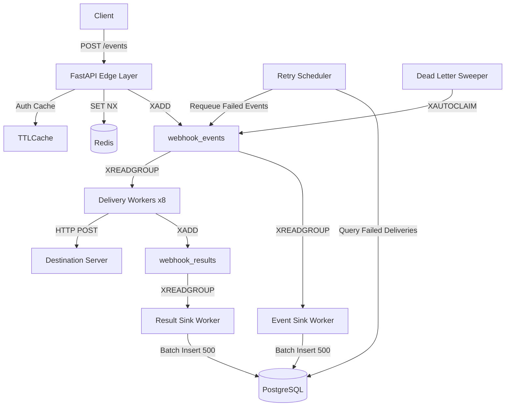

# Webhook Delivery Platform

A highly concurrent, production-grade webhook dispatcher built with FastAPI, PostgreSQL, Redis Streams, and asynchronous worker processes.

The platform guarantees **at-least-once delivery**, performs asynchronous webhook execution, retries failures using exponential backoff, and completely decouples API ingestion from database persistence.

---

# Architectural Evolution

## Phase 1 — Synchronous CRUD Architecture

The system initially followed a traditional synchronous design.

### Request Flow

1. Receive incoming event.
2. Insert event into PostgreSQL.
3. Push event ID to Redis.
4. Return `202 Accepted`.

### Bottleneck

Under heavy load (500 concurrent clients), API workers rapidly exhausted the PostgreSQL connection pool.

As requests accumulated:

* Database connections became the primary bottleneck.
* Requests waited for available connections.
* Memory pressure increased.
* Latency grew dramatically.

### Observed Results

| Metric              | Value                      |
| ------------------- | -------------------------- |
| Average API Latency | 790ms+                     |
| Maximum Latency     | 4s+                        |
| Primary Bottleneck  | PostgreSQL Connection Pool |

---

## Phase 2 — Distributed Asynchronous Architecture

To remove database contention from the critical request path, the platform was redesigned around an asynchronous ingestion model.

The API layer no longer communicates with PostgreSQL while processing incoming requests.

### Edge Ingestion Layer

The FastAPI API layer performs:

* API key authentication through in-memory TTLCache
* Endpoint ownership validation
* Redis-based idempotency checks (`SET NX`)
* Payload enrichment ("Fat Messages")
* Redis Stream publication

After publication to Redis, the request immediately returns.

### Delivery Workers

Eight independent delivery worker processes consume messages from Redis Streams.

Responsibilities:

* Read events from stream
* Execute outbound HTTP POST requests
* Generate delivery results
* Publish results to a second stream

Workers perform:

* No PostgreSQL writes
* No PostgreSQL reads
* No foreign-key lookups

This eliminates database contention from delivery execution.

### Sink Workers

Dedicated sink workers batch data into PostgreSQL.

#### Event Sink

Consumes events and performs bulk inserts.

#### Result Sink

Consumes delivery results and performs bulk inserts.

Batch persistence significantly reduces:

* Transaction overhead
* Lock contention
* Connection churn

### Eventual Consistency

Redis acts as the system's write buffer.

Persistence occurs asynchronously, allowing:

* High throughput ingestion
* Reduced latency
* Controlled database load

---

# System Architecture



---

# Core Infrastructure Patterns

## Asynchronous Ingestion

No database operations occur on the API write path.

Benefits:

* Lower latency
* Higher throughput
* No connection pool starvation

---

## Payload Enrichment (Fat Messages)

Events contain all information required for delivery.

Benefits:

* Zero database lookups during execution
* Faster workers
* Reduced operational complexity

---

## Redis-Based Idempotency

Duplicate requests are rejected using:

```text
SET key value NX EX ttl
```

Benefits:

* Constant-time duplicate detection
* Prevents duplicate deliveries
* Protects downstream systems

---

## Fault Recovery

A dedicated sweeper process uses:

```text
XAUTOCLAIM
```

to reclaim messages from crashed workers.

Benefits:

* Automatic recovery
* No orphaned messages
* Improved reliability

---

## Multi-Tenant Isolation

Every API key is scoped to its owner.

Validation includes:

* API key ownership
* Endpoint ownership
* Tenant isolation

---

## HMAC Signatures

Every outbound webhook includes:

```text
X-Signature
```

generated using:

```text
HMAC-SHA256
```

Benefits:

* Payload verification
* Tamper detection
* Consumer-side authenticity checks

---

## Eventual Consistency

Redis absorbs write bursts while PostgreSQL persists data asynchronously.

Benefits:

* Stable database load
* Improved scalability
* Higher throughput

---

# Performance Benchmarks

## Test Configuration

Infrastructure:

* 4 Uvicorn API processes
* 8 Delivery Worker processes
* 1 Event Sink Worker
* 1 Result Sink Worker
* 1 Retry Runner

Load Test:

* 10,000 Requests
* 500 Concurrent Clients

---

## Results

| Metric                       | Result       | Evaluation                             |
| ---------------------------- | ------------ | -------------------------------------- |
| Throughput                   | 1,047.80 RPS | Sustained throughput exceeded 1K RPS   |
| Average API Latency          | 166.21 ms    | Stable under heavy load                |
| Delivery Queue Delay         | 6.62 ms      | Near real-time consumption             |
| Database Ingestion Lag       | 6.72 ms      | Minimal persistence delay              |
| Batch Insert Time (500 rows) | 4.96 ms      | PostgreSQL handled inserts efficiently |
| Success Rate                 | 100%         | No event loss                          |
| Persistence Rate             | 100%         | Stream backlog fully drained           |

---

# Deployment

To simulate a production-style deployment locally:

```bash
chmod +x scripts/start_local.sh
./scripts/start_local.sh
```

---

# Running Services

```text
4x  uvicorn processes
8x  delivery workers
1x  event sink worker
1x  result sink worker
1x  retry runner
```

---

# Future Improvements

## Retry Scheduling

Current implementation:

* Polls PostgreSQL every 5 seconds

Potential upgrades:

* PostgreSQL LISTEN / NOTIFY
* Redis delayed queues
* RabbitMQ delayed exchanges
* Dedicated scheduling service

---

## Distributed Tracing

Current implementation:

* Structured JSON logs

Future implementation:

* OpenTelemetry
* OTLP Exporters
* Grafana Tempo
* Jaeger

This will provide end-to-end visibility across:

* API ingestion
* Redis Streams
* Delivery workers
* Sink workers
* PostgreSQL persistence

---

# Key Outcomes

* Completely removed PostgreSQL from the API write path.
* Eliminated connection-pool bottlenecks during ingestion.
* Achieved sustained throughput above 1,000 requests/sec.
* Reduced queue processing delays to single-digit milliseconds.
* Maintained 100% event persistence and delivery tracking.
* Built a fault-tolerant distributed pipeline using FastAPI, Redis Streams, and PostgreSQL.
* Established a scalable foundation for future observability, tracing, and horizontal scaling initiatives.
